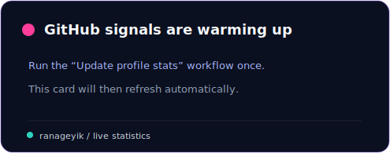

<p align="center">
  
</p>

<p align="center">
  <strong>Designer × Developer × Entrepreneur</strong><br />
  <sub>AI-Native Marketplace Architect · Product Builder · Full-Stack Developer</sub>
</p>

<p align="center">
  <a href="https://github.com/ranageyik?tab=repositories"></a>
  <a href="https://github.com/ranageyik"></a>
</p>

---

### I design the system — then I build it.

I work at the intersection of **product design, full-stack engineering and AI-native commerce**. My focus is turning complex marketplace problems into human, accessible and scalable digital systems.

Currently building **BizMoto** as **Co-CEO & Product Lead** — an AI-native motorcycle ecosystem designed around fitment accuracy, trust and better commerce decisions.

<table>
  <tr>
    <td width="50%" valign="top">
      <h3>◉ Product systems</h3>
      <p>Marketplace architecture, product strategy, design systems, trust layers and end-to-end user journeys.</p>
    </td>
    <td width="50%" valign="top">
      <h3>✦ Creative practice</h3>
      <p>Visual design, art direction, storytelling, music and experimental digital experiences.</p>
    </td>
  </tr>
  <tr>
    <td width="50%" valign="top">
      <h3>⌁ AI-native workflows</h3>
      <p>Agent-assisted product development, RAG, automation and systems that turn context into action.</p>
    </td>
    <td width="50%" valign="top">
      <h3>↗ Full-stack execution</h3>
      <p>From interface and API design to data architecture, deployment and production operations.</p>
    </td>
  </tr>
</table>

### Current signal

```text
BUILDING     BizMoto — the intelligence layer for motorcycle commerce
FOCUS        Fitment · Trust · Marketplace architecture · Human-first UX
EXPLORING    AI agents · Search intelligence · Creative technology
PRINCIPLE    Make complexity feel obvious.
```

### Selected toolbox

<p>
  
  
  
  
  
  
  
  
  
  
</p>

### Live build signals

<p align="center">
  
  
</p>

<p align="center">
  <sub>Stats refresh automatically through GitHub Actions.</sub>
</p>

---

<p align="center">
  <strong>Designing futures that are useful, alive and unmistakably human.</strong><br />
  <sub>Denizli, Türkiye · Building for everywhere</sub>
</p>

